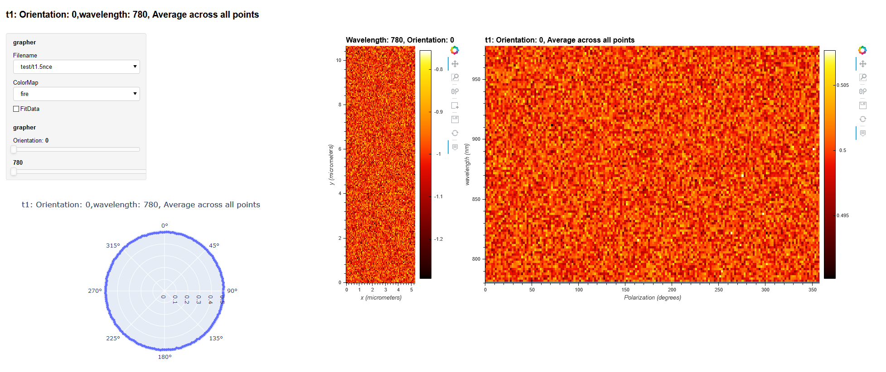

# 5d spectral visualizer
Originally the _holoviz_ branch of [2020SummerResearch](https://github.com/UNTNeogiLab/2020SummerResearch)
## Installing Dependencies 
### Using Pipfile (requires python)
`pip install --user pipenv` (unpriviledged installation, use `pip install pipenv` or use package manager for global install)  
`pipenv install` (installs dependencies)  
## Running 
`pipenv python combined.py` (runs visualization script)   
## Server Deployment
Requires environment with all files
### UNT servers  
1. `panel serve combined.py --address 0.0.0.0 --dev scripted/*.py` on compute node   
1. `ssh -L 5006:cX-X-X:5006 EUID@vis-01.acs.unt.edu` on local   
1. open localhost:5006 on local browser
### Generally 
1. `panel serve combined.py --address 0.0.0.0 --dev scripted/*.py` on server  
1. port forwarding depending on network configuration   
1. open address:5006 on local browser
## Examples

##Decapretated Documentation
### Using setup.py (requires python and anaconda)
`python setup.py` (older script, depends upon mamba/conda, slower, harder to maintain)
### Using bare pip 
`pip install -r config/requirements.txt`  
### Jupyter Lab:
Jupyter lab is decapretated in favor of python scripts
## Server Deployment
Requires environment with all files
### UNT servers  
1. `panel serve combined.py --address 0.0.0.0` on compute node   
1. `ssh -L 5006:cX-X-X:5006 EUID@vis-01.acs.unt.edu` on local   
1. open localhost:5006 on local browser
### Generally 
1. `panel serve parameterized.ipynb --address 0.0.0.0` on server  
1. port forwarding depending on network configuration   
1. open address:5006 on local browser
